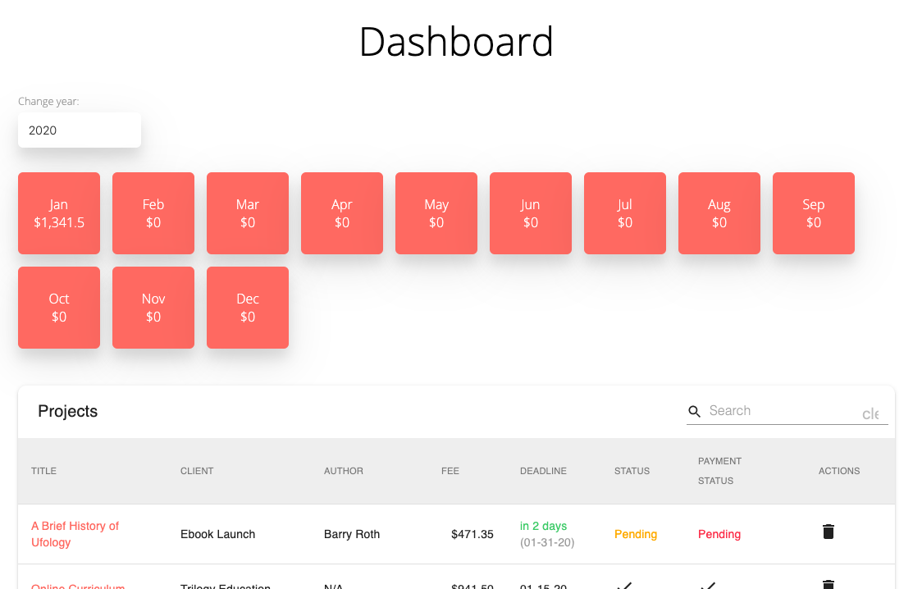

# PeachFlame

## Live Link
[peachflame.co](peachflame.co)

## Contributors
@acd37

## Technologiy Stack
* NodeJS, ExpressJS, ReactJS, Passport, Redux, NodeMailer

## About
* PeachFlame is a lightweight CRM that allows freelancers to track clients and projects, as well as income

## Home Page

## Dashboard Page

## Using this Code 
* Clone the repository to your desired location.
* `npm install`
* `npm run dev`

## License 
* MIT

## Contact
#### Developer/Full-stack Web Software Developer
* Name: Alec Down (@acd37)
* Homepage: [alecdown.com](https://alecdown.com)
* e-mail: alecdown@gmail.com
* Twitter: @acdown87
* LinkedIn: https://www.linkedin.com/in/alecdown/

